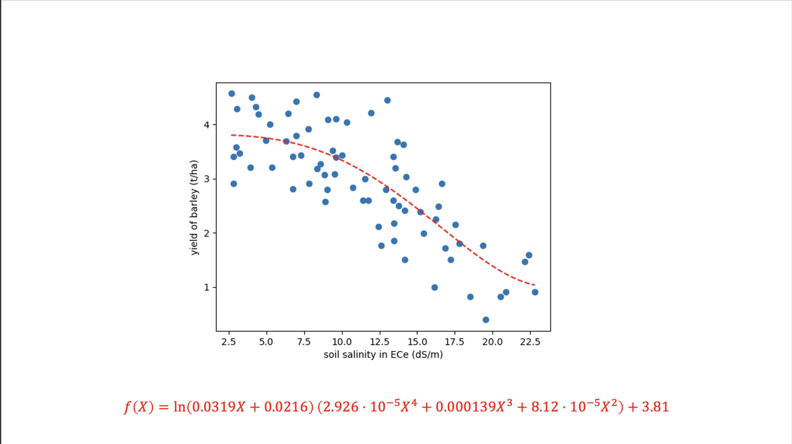
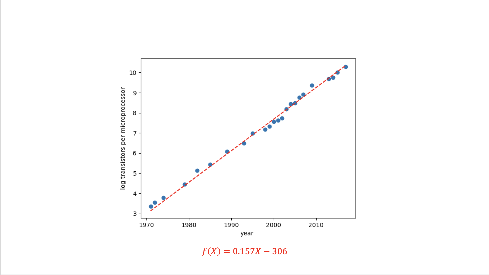
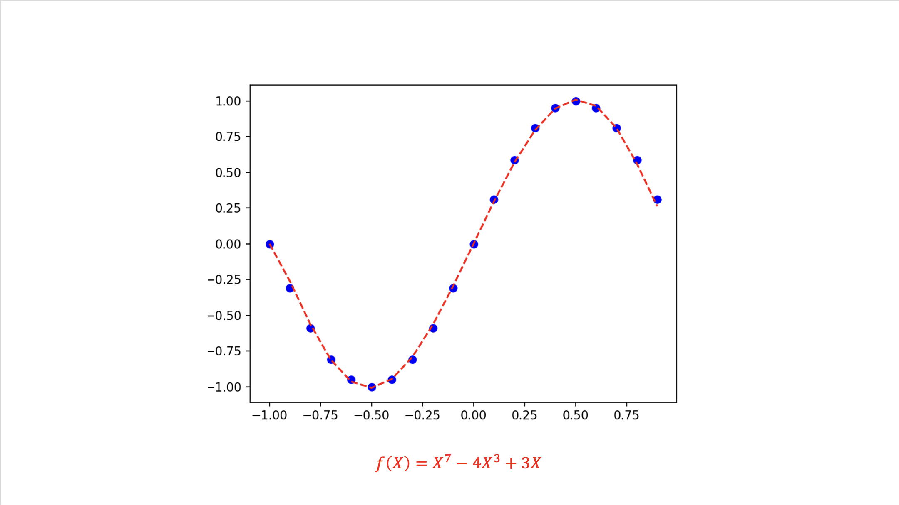
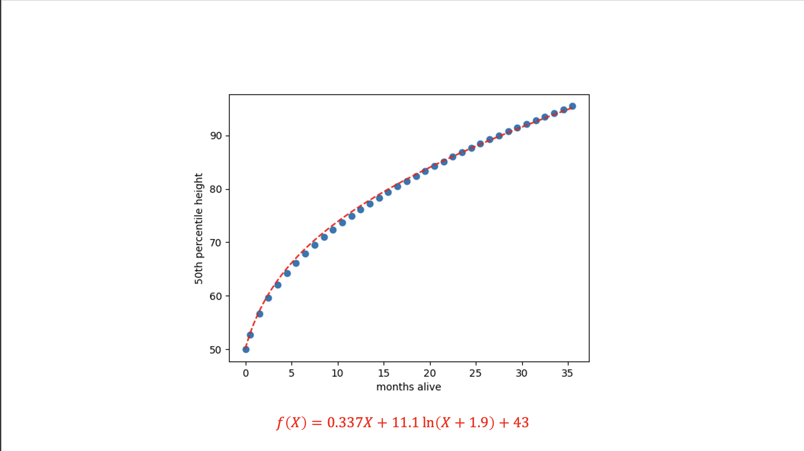

# genetic-programming

This repository stores code for my symbolic regression system. Symbolic regression is a technique for evolving a mathematical function that models a certain dataset. For more information on symbolic regression see [wikipedia](https://en.wikipedia.org/wiki/Symbolic_regression)

## Examples

below are some exmaples of mathematical models discovered using this system:

|  |
| :--------------------------------------------------------------: |
|                The relationship between soil salinity and crop yields                |

|  |
| :--------------------------------------------------------------: |
|                Moore's Law                |

|  |
| :--------------------------------------------------------------: |
|                A polynomial approximation of a sin curve                |

|  |
| :--------------------------------------------------------------: |
|                Approximations of pi                |

|  |
| :--------------------------------------------------------------: |
|                The average growth curve of infants                |
## usage

```
usage: symreg [-h] [--suggest {linear,exponential,quadratic,poly3,poly4,log}] [--psize PSIZE] [--updatefreq UPDATEFREQ] [--sizepenalty SIZEPENALTY] path

Use symbolic regression to fit a curve to data

positional arguments:
  path                  the path to the data (csv format)

options:
  -h, --help            show this help message and exit
  --suggest {linear,exponential,quadratic,poly3,poly4,log}
                        suggest a class of functions as the starting point for evolution
  --psize PSIZE         the population size to use (30 by default)
  --updatefreq UPDATEFREQ
                        how often to update the display (every 10 generations by default)
  --sizepenalty SIZEPENALTY
                        how much to penalize large trees (0.001 by default)
```

## packages needed

```
matplotlib
sympy
graphviz
```
